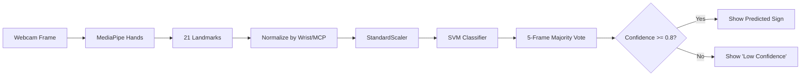

<div align="center">

# SignDetection

### Real-Time Hand Sign Detection with MediaPipe + SVM

*Point a webcam at your hand, and watch it recognize signs live in the browser.*


</div>

---

## 📖 Table of Contents

- [About](#-about)
- [How It Works](#-how-it-works)
- [Project Structure](#-project-structure)
- [Prerequisites](#-prerequisites)
- [Getting Started](#-getting-started)
  - [1. Clone the repository](#1-clone-the-repository)
  - [2. Create a virtual environment](#2-create-a-virtual-environment)
  - [3. Install dependencies](#3-install-dependencies)
- [Usage](#-usage)
  - [Step 1 — Collect data & train a model](#step-1--collect-data--train-a-model)
  - [Step 2 — Run the live detector](#step-2--run-the-live-detector)
- [API Reference](#-api-reference)
- [Notes & Limitations](#-notes--limitations)
- [Contributing](#-contributing)
- [License](#-license)

---

## 📌 About

**SignSense** is a real-time hand sign / gesture recognition system. It uses **MediaPipe** to extract 21 hand landmarks from a webcam feed, feeds normalized landmark coordinates into a trained **SVM classifier**, and displays the predicted sign live through a clean web dashboard.

The project has two parts:

| Component | File(s) | Purpose |
|---|---|---|
| 🎥 **Detection app** | `app.py` + `static/` | FastAPI backend that streams your webcam to a web UI and overlays the predicted sign in real time. Requires an already-trained model. |
| 🧠 **Data & training tool** | `CollectEvalute.py` | Standalone Tkinter desktop app for recording your own gesture dataset, training the SVM model, and evaluating accuracy. Run this first if you don't already have a trained model. |

---

## ⚙️ How It Works

Both scripts share the exact same pipeline, so a model trained with `CollectEvalute.py` works directly with `app.py`:

1. **Hand tracking** — MediaPipe Hands detects one hand and returns 21 `(x, y, z)` landmarks.
2. **Normalization** — every landmark is made relative to the wrist (landmark 0), then scaled by the wrist-to-middle-MCP (landmark 9) distance — this keeps features roughly invariant to hand position and distance from the camera.
3. **Feature vector** — normalized landmarks are flattened into a 63-value vector (21 × 3).
4. **Scaling** — a fitted `StandardScaler` transforms the vector.
5. **Classification** — an `SVC(kernel='rbf', probability=True)` predicts a label and confidence score.
6. **Smoothing** — predictions are buffered over the last 5 frames; the majority label is shown only if its average confidence is **≥ 0.8**, otherwise the UI displays *"Low Confidence."*



---

## 🗂️ Project Structure

```
Sign-Detect/
├── app.py                 # FastAPI backend — real-time detection + web UI server
├── CollectEvalute.py      # Tkinter app — data collection, training, evaluation
├── static/
│   ├── index.html         # Web dashboard
│   ├── script.js          # Frontend logic (start/stop, polling, status)
│   └── style.css          # Dashboard styling
├── svm_model.pkl          # Trained SVM model (generated after training)
├── scaler.pkl             # Fitted StandardScaler (generated after training)
├── dataset.csv            # Collected landmark data with labels (generated after collection)
└── README.md
```

> ⚠️ **Important:** `app.py` expects `index.html`, `script.js`, and `style.css` inside a `static/` folder next to it, and `svm_model.pkl` / `scaler.pkl` directly next to it. It refuses to start if `static/` is missing, and detection reports "no model found" until both `.pkl` files exist.

---

## ✅ Prerequisites

Before you begin, make sure you have:

- **[Git](https://git-scm.com/downloads)** — to clone the repository
- **[Python 3.9+](https://www.python.org/downloads/)** — to run the app
- A **webcam**
- (Optional but recommended) **[VS Code](https://code.visualstudio.com/)** or any code editor

Check your versions:

```bash
git --version
python --version   # or python3 --version
```

---

## 🚀 Getting Started

### 1. Clone the repository

```bash
git clone https://github.com/siddarthshinde06/Sign-Detect.git
cd Sign-Detect
```

### 2. Create a virtual environment

Isolating dependencies in a virtual environment is strongly recommended.

**Windows**

```bash
python -m venv venv
venv\Scripts\activate
```

**macOS / Linux**

```bash
python3 -m venv venv
source venv/bin/activate
```

You'll know it worked when your terminal prompt is prefixed with `(venv)`.

### 3. Install dependencies

```bash
pip install --upgrade pip
pip install fastapi uvicorn opencv-python mediapipe numpy joblib scikit-learn pandas
```

> `tkinter` is required by `CollectEvalute.py` and ships with most standard Python installs. If it's missing on Linux, install it with `sudo apt install python3-tk`.

---

## 🎯 Usage

### Step 1 — Collect data & train a model

If you don't already have `svm_model.pkl` and `scaler.pkl`, run the training tool:

```bash
python CollectEvalute.py
```

This opens a desktop app with four tabs:

| Tab | What it does |
|---|---|
| **Data Collection** | Enter a gesture label (e.g. `A`, `Hello`) and a target sample count, then show the gesture to your webcam. Each frame is stored 3× (original, mirrored, and with light noise added) to improve generalization. Data is appended to `dataset.csv`. |
| **Model Training** | Runs a grid search (`C` × `gamma`) over an RBF-kernel SVM with 5-fold cross-validation, then saves the best model as `svm_model.pkl` and scaler as `scaler.pkl`. Reports accuracy and a confusion matrix. |
| **Real-Time Prediction** | A quick OpenCV preview window to sanity-check the trained model before deploying it. |
| **Settings & Stats** | View class distribution in `dataset.csv`, clear the dataset, or export a results summary. |

> 💡 Repeat data collection for **every gesture** you want the model to recognize before training. More samples and more variation (angle, lighting, distance) = better accuracy.

### Step 2 — Run the live detector

Once `svm_model.pkl` and `scaler.pkl` exist next to `app.py`, start the server:

```bash
python app.py
```

You should see:

```bash
SignSense Detector starting -> http://localhost:8000
```

Open that URL in your browser:

```bash
http://localhost:8000
```

Then:

- Click **Start Detection** — opens the webcam feed with landmarks drawn live
- Watch the predicted sign and confidence bar update below the video
- Click **Reload Model** to pick up a freshly retrained model without restarting the server
- Click **Stop** to release the camera

---

## 🔌 API Reference

`app.py` exposes a small JSON API alongside the static frontend:

| Method | Endpoint | Description |
|--------|-----------|-------------|
| `POST` | `/api/start` | Opens the camera and starts detection |
| `POST` | `/api/stop` | Stops detection and releases the camera |
| `POST` | `/api/reload_model` | Reloads `svm_model.pkl` / `scaler.pkl` from disk |
| `GET` | `/api/status` | Current state: running, model status, last prediction, hand-detected flag |
| `GET` | `/video_feed` | MJPEG stream of the annotated camera feed (only while running) |

---

## 📝 Notes & Limitations

- Only **one hand** is tracked at a time (`max_num_hands=1`).
- Camera opening tries platform-specific backends first — DirectShow/MSMF on Windows, AVFoundation on macOS, V4L2 on Linux — falling back to the default and retrying briefly before giving up.
- Predictions need **5 consecutive frames** to stabilize before anything is shown; confidence below **0.8** is deliberately displayed as *"Low Confidence"* rather than a guess.
- Recognition quality depends entirely on the dataset recorded in `CollectEvalute.py` — more samples per label and more real-world variation noticeably improve accuracy.

---

## 🤝 Contributing

Contributions are welcome!

1. Fork the repository
2. Create a feature branch — `git checkout -b feature/your-feature`
3. Commit your changes — `git commit -m "Add your feature"`
4. Push to your branch — `git push origin feature/your-feature`
5. Open a Pull Request

---

## 📄 License

This project is licensed under the **MIT License** — Siddarth shinde

---

<div align="center">

Made with ❤️ using MediaPipe, scikit-learn, and FastAPI

</div>
